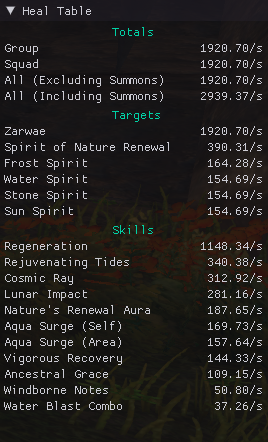

# ArcDPS Healing Stats
Show healing statistics based on your local stats (i.e. your own healing output).

This includes outgoing healing per agent and per skill, as well as filtering to only include your own subgroup/squad or to exclude minions. Format of the window title and contents are fully configurable and windows can be configured to show different data (targets healed, skills used to heal, total healing).

If live stats sharing is enabled, also allows you to see other players in your squads healing stats (and them to see yours)

Also logs healing to the arcdps evtc, allowing evtc parsers to show healing stats.

## Installation
Requires [ArcDPS](https://www.deltaconnected.com/arcdps/).

Download the latest [arcdps_healing_stats.dll](https://github.com/Krappa322/arcdps_healing_stats/releases/latest) from the Releases page. Drag and drop arcdps_healing_stats.dll into the bin64\ directory (same directory as where arcdps d3d9.dll is)

## Usage
Toggle any window under the "Heal Stats" menu in the arcdps main menu. Right-click the window to see more options and hover over options to see what they do. All configuration is done per window, and there can be up to 10 different windows.

To enable live-sharing of healing stats, allowing you to see others healing stats (and them to see yours), go to "Heal Stats Options" and check the checkbox for "enable live stats sharing"

## Issues and requests
Please report issues and requests using the github issue tracker

## Pictures

## Technical information
This addon uses the local stats provided by ArcDPS to count healing done. This information is only available for the local player, i.e. the server does not notify about healing done by other players to other players. As such it is not possible to extend the addon to include everyone's healing without every player in the instance having the addon installed.

## Planned features
- Displaying healing done per time skill was cast
- Track overhealing. This is kind of hard because it would require simulating healing events and how much they should be healing (which requires knowing all modifiers and such). Please open an issue with suggestions for how to do this if you know of any :)
- Store history similar to that available in the vanilla ArcDPS dps window (i.e. show statistics for previous encounters)
- Display a graph showing healing done over time (allowing visualisation of when healing pressure is high)
- More statistics than just healing. Confusion comes to mind, since the 10 man log method mentioned above could in the case of confusion create a log that shows true dps done for bosses where self stats and area stats don't match (such as Soulless Horror)

## Copyright Notice
This project is licensed under the MIT license (see the LICENSE file for more details). It makes use of the following third party libraries (they are all statically linked):
### arcdps-extension
[arcdps-extension](https://github.com/knoxfighter/arcdps-extension), licensed under the MIT license and included in this project as a git submodule of [arcdps_mock](/arcdps_mock).
### Dear ImGui
[Dear ImGui](https://github.com/ocornut/imgui), licensed under the MIT license and included in this project as a git submodule [imgui](/imgui).
### GoogleTest
[GoogleTest](https://github.com/google/googletest), licensed under the BSD-3-Clause license and included in this project as a linking/header dependency (provided through vcpkg).
### gRPC
[gRPC](https://github.com/grpc/grpc), licensed under the Apache-2.0 license and included in this project as a linking/header dependency (provided through vcpkg).
### JSON for Modern C++
[JSON for Modern C++](https://github.com/nlohmann/json), licensed under the MIT license and included in this project as a linking/header dependency (provided through vcpkg).
### Prometheus Client Library for Modern C++
[prometheus-cpp](https://github.com/jupp0r/prometheus-cpp), licensed under the MIT license and included in this project as a linking/header dependency (provided through vcpkg).
### Protocol Buffers
[Protocol Buffers](https://github.com/protocolbuffers/protobuf), licensed under the BSD-3-Clause license and included in this project as a linking/header dependency (provided through vcpkg).
### simpleini
[simpleini](https://github.com/brofield/simpleini), licensed under the MIT license and included in this project as a directory [simpleini](/simpleini).
### spdlog
[spdlog](https://github.com/gabime/spdlog), licensed under the MIT license and included in this project as a linking/header dependency (provided through vcpkg).
